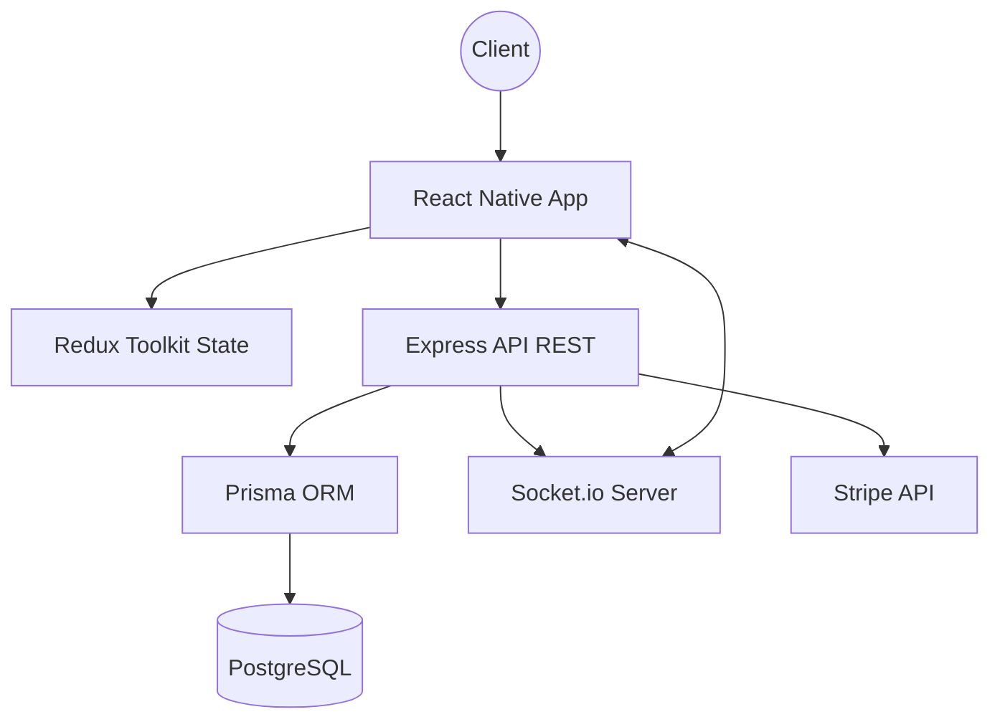

# ELITEFORCE.GLOBAL - MultiServices Security App

[]()
[]()
[]()
[]()

EliteForce est une application de services de sécurité haut de gamme permettant aux utilisateurs de réserver des prestations professionnelles (Protection VIP, Cybersécurité, Vidéosurveillance) avec suivi en temps réel et paiement sécurisé.

---

## 📸 Screenshots

| Accueil | Recherche | Détails |
| :--- | :--- | :--- |
|  |  |  |

| Réservations | Suivi Live | Profil |
| :--- | :--- | :--- |
|  |  |  |

---

## 🛠 Stack Technique

- **Mobile** : React Native (Expo SDK 55), Redux Toolkit, React Navigation v7, Iconsax.
- **Backend** : Node.js, Express, TypeScript, Prisma ORM.
- **Base de données** : PostgreSQL.
- **Temps Réel** : Socket.io (Suivi prestataire & Statuts).
- **Paiement** : Stripe (Flux complet avec Webhooks).
- **Cartographie** : React Native Maps (Google Maps / Apple Maps).

---

## 🚀 Fonctionnalités Clés

- **Authentification Sécurisée** : JWT avec expiration 7j, Bcrypt (12 rounds), validation stricte des mots de passe.
- **Catalogue de Services** : 10 services pré-remplis, filtres avancés (prix, note, catégorie).
- **Système de Réservation** : Calcul automatique des prix, gestion des disponibilités.
- **Paiement Stripe** : Confirmation de paiement via Webhook et mise à jour automatique du statut.
- **Suivi en Temps Réel** : Position du prestataire sur carte live et notifications push Expo.
- **Design Minimaliste** : Interface épurée, sans ombrages, conforme aux standards haut de gamme.

---

## 📂 Architecture du Projet



---

## ⚙️ Installation & Lancement

### Prérequis
- Node.js v20+
- PostgreSQL
- Expo Go sur votre mobile

### 1. Backend
```bash
cd backend
npm install
cp .env.example .env # Configurez vos variables (DB, JWT, STRIPE)
npx prisma migrate dev
npm run seed # Injecte les 10 services et l'admin
npm run dev
```

### 2. Mobile
```bash
cd mobile
npm install
cp .env.example .env # Configurez API_URL avec votre IP locale
npx expo start
```

---

## 🛡️ Sécurité & Performance
- **Rate Limiting** : 100 req/15min par IP, 5 tentatives de login/h.
- **Validation** : Express Validator pour toutes les entrées.
- **Headers** : Helmet.js pour la protection XSS et clickjacking.
- **CORS** : Configuration stricte autorisant uniquement les domaines connus.

---

## 📝 Liste des Endpoints (API)

| Méthode | Route | Description | Accès |
| :--- | :--- | :--- | :--- |
| POST | `/api/auth/register` | Inscription utilisateur | Public |
| POST | `/api/auth/login` | Connexion & Retourne JWT | Public |
| GET | `/api/services` | Liste filtrable des services | Public |
| POST | `/api/bookings` | Créer une réservation | CLIENT |
| GET | `/api/bookings/me` | Historique de réservations | CLIENT |
| POST | `/api/payments/create-intent` | Créer l'intention Stripe | CLIENT |

Documentation complète Swagger disponible sur : `http://localhost:3000/api/docs`

---

## 🤝 Contribution
1. Clonez le repo.
2. Créez une branche `feature/amazing-feature`.
3. Commitez vos changements (min. 10 commits requis pour le test).
4. Push vers la branche.

---
© 2026 EliteForce Security Group - Test Technique Senior.
